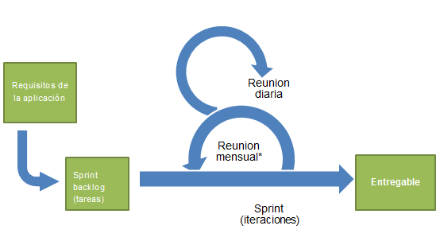

#Scrum

In this document we will give a brief introduction to Scrum and how the process works. We are also explaining the way we are applying it to our development as a simple step-by-step guide for reference.

## What is Scrum

Scrum is a software development methodology, within Agile software development, based in incremental and iterative development.



#### Roles in Scrum

There are three main roles:

1. **Product Owner**: Represents the stakeholders and is the voice of the customer. He is in charge of specifying the ```user stories``` that the project must include, prioritize them and negotiate with the team which ones will be included in each *Sprint*.
2. **Scrum Master**: Is accountable for removing impediments to the ability of the team to deliver the product goals and deliverables. The *Scrum Master* ensures that the Scrum process is used as intended.
3. **Development Team**: It is responsible for delivering potentially shippable increments of product at the end of each *Sprint* (the Sprint Goal). It is mostly self-organizing. Both the *Product Owner* and the *Scrum Master* can also be part of the Development Team.

The *Product Owner*, *Development Team* and *Scrum Master* make the **Scrum Team**.


#### Sprint

A *Sprint* or iteration is the unit of development in Scrum, that is, a temporal effort. The duration is between 2 and 4 weeks.

Each Sprint is starting by a planning meeting where the tasks are identified and estimated. In the end of Sprint there is another meeting named "review-and-retrospective" where the progress is reviewed.

According to Wikipedia: "Scrum emphasizes working product at the end of the Sprint that is really "done"; in the case of software, this means a system that is integrated, fully tested, end-user documented, and potentially shippable."


#### Meetings

1. **Sprint Planning Meeting**: At the beginning of the Sprint a meeting is held between the *Product Owner* and the *Development Team* to discuss the work that is to be done in the next iteration. The *Product Owner* proposes *user stories* (functionalities) from the *Product Backlog* to the team, and they commit to doing them in an estimated amount of time. They keep adding *user stories* to the *Sprint Backlog* until the team thinks that they have "filled the bucket". There are not any fancy schedules or calculations, the team can know when they've taken enough work for the period. The Product Owner and the team discuss in order to add as much value as possible, taking into account dependencies and technical details.

2. **Standup Daily** or Daily Scrum: (Commitment meeting) In these short meetings, usually 15 minutes long, every team member explain what they have done since the last meeting, what they are going to get done until the next one, and got in their way. These meetings are important so no one gets stuck, if there is any problem the team must work it out in order to keep working. 

3. **Sprint Review**: At the end of a Sprint, we show the stakeholders the work that has been done, what the team committed to do, and the iteration's final product. This way they can see what the progress has been in the product, and maybe provide feedback to the team.

4. **Sprint Retrospective**: The development team reviews how they have worked, and they make some agreements about how they are going to change their process and the way they work with each other in order to improve.


#### Documents

1. **Product Backlog**: It is an ordered list of *stuff* that needs to get done from a business standpoint. It is the most familiar thing to a requirements document in a traditional methodology. The *Product Owner* is responsible for creating the the Product Backlog as a "hit shield" between the stakeholders and the development team, and it might change between Sprints. It should be ordered by priority, depending on the business value added to the product. It is defined by means of **user stories**, which determine what the stakeholders expect from the product: 
> As a **user** I want **to be able to upload a recipe** in order to **share my knowledge**.

2. **Sprint Backlog**: It is the list of **user stories** that the team committed (agreed) to get done in the current Sprint. It can NEVER be changed during the Sprint, in extreme circumstances it can only be cancelled, but stakeholders cannot ask for more functionalities until the Sprint is finished.

3. **Increment**: It is a product completed after a Sprint. It must be a usable product ready for production, even though it is not finished .

4. **Burndown chart**: It is a chart, updated every day, that gives a simple view of the Sprint progress. It compares the amount of work done at the moment against the amount of work yet to be done. It is a quick way of telling if the development team is keeping up with the *Sprint Backlog*.


## How are we using it

(step by step guide)

### Completing tasks

The following steps are the ones every team member needs to follow to carry out the tasks they are assigned to.

###### 1. GitHub: Assign task

###### 2. SourceTree: Prepare to work

###### 3. *Do the work*

###### 4. SourceTree: Upload the work

###### 5. GitHub: Finish your task


## References

- [The Scrum Framework, in 10 minutes [video]](http://www.youtube.com/watch?v=_BWbaZs1M_8) <- Please, check this one out!
- [Wikipedia](http://en.wikipedia.org/wiki/Scrum_(software_development)