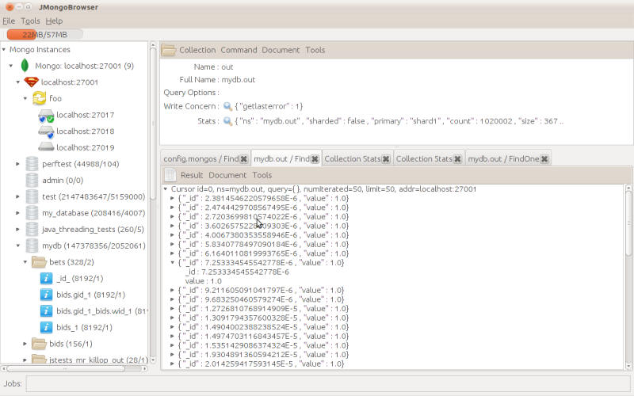
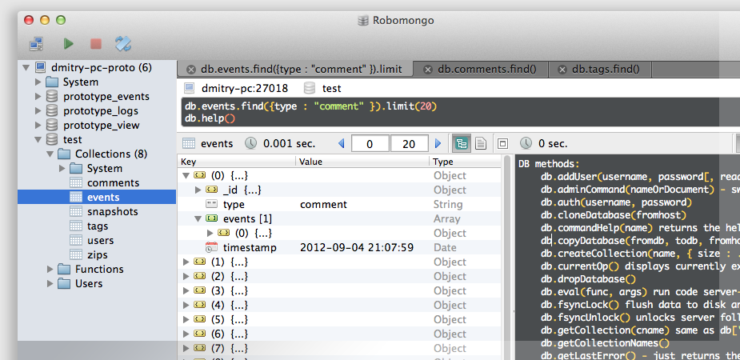
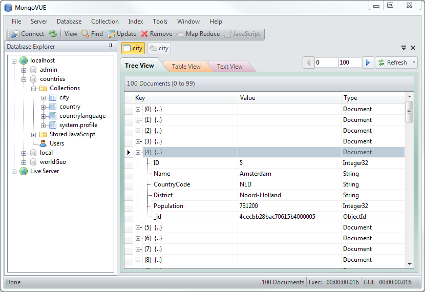

# MongoDB Viewers

### UMongo

Available for Windows, OSX and Linux. Simple desktop app.

[Download](http://edgytech.com/umongo/)

### mViewer

Available for Windows, OSX and Linux. Web-based. 

[Download](https://github.com/Imaginea/mViewer)

[Demo video](https://www.youtube.com/watch?v=PbgNtvjc3Ug)

### Robomongo

Available for Windows, OSX and Linux. Desktop app.

[Download](http://robomongo.org/)

### MongoVUE

Only for Windows.

[Download](http://blog.mongovue.com/)

### MongoHub

Only for OSX. 

[Download](https://github.com/fotonauts/MongoHub-Mac)