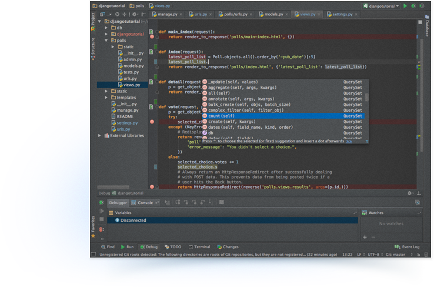

#PyCharm

PyCharm is an advanced Python multi-platform IDE created by JetBrains, with powerful code assistance, automated refactoring, rich navigation, integrated debugger, native VCS integration, and more.

There is a Free Community Edition, available under Apache 2 license. There is also a Professional Edition which supports multi-language and web development frameworks like Django.

#### What I personally love about PyCharm (Rafa Vázquez)
In my opinion as Develper Lead, the best features of PyCharm are the code completion, the amazing code refactoring, and the debugger with step-by-step capabilities. PyCharm has these features in common with IntelliJ (for Java), wich I use and love a lot for my daily Android development.

## Download
We are going to use the **Professional Edition** because of Python Support. It has ha 30-day free trial period, after which you need a license. The team will be using the trial while we get in touch with the teachers in order to adquire a free student license.

[Download Link](http://www.jetbrains.com/pycharm/download/)

## Basic configuration

> Here goes additional configuration needed for the project, such as Python interpreter or VirtualEnv.

## References

- [PyCharm website](http://www.jetbrains.com/pycharm/)
- [Django related features](http://www.jetbrains.com/pycharm/features/#djangoIDE)
- [PyCharm overview video](http://www.youtube.com/watch?v=iutkLjeGc6w#t=23)